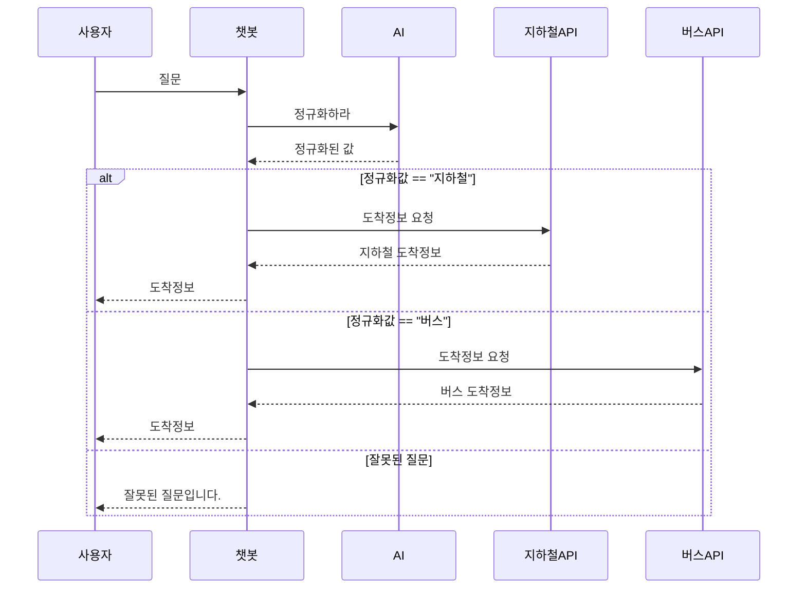

# 🚀 Developer Guide

## 프로젝트 개요 및 파일 구조

이 챗봇 프로젝트는 서울·경기 지역의 버스 및 지하철 도착정보를 제공하는 텍스트 기반 서비스입니다.
사용자가 질문을 입력하면 KoELECTRA 딥러닝 모델로 입력문을 파싱하여 ‘버스’ 또는 ‘지하철’로 분기하고, 해당 교통수단의 도착정보 API를 호출하여 결과를 반환합니다.

## 사전준비
- **Python 3.8 이상 필요**
- git
- 공공 데이터 포털의 APIKey 
- **사용할 API 신청 필요 https://www.data.go.kr/ 에서 신청**

##  📁 파일 구조
``` 
├── data/
├── chatbot/
│   ├── dispatcher.py
│   ├── bus_handler.py
│   ├── subway_handler.py
│   └── (생략: views.py, urls.py, models.py, admin.py, apps.py, tests.py, __init__.py 등 Django 기본)
├── scripts/
│   ├── download_model.py
│   ├── koelectra_training_code.ipynb
│   └── runKoelectra.py
├── chatbot_project/
├── db.sqlite3
├── setup_project.py
├── manage.py
├── README.md
└── finetuned_model/ # github에 올라와있진 않음
```
## 주요 디렉토리와 파일 구성 설명:
- data/: 버스·지하철 정류장, 노선, 역 ID 매핑용 csv/json 파일 저장 (ex: 서울/경기 버스정류소, 지하철역 정보 등)
- chatbot/: Django 앱. 모델 연동/질문 분기/핸들러/API 응답 등 챗봇 전체 핵심 서비스 로직
  - `dispatcher.py`: KoELECTRA 예측 결과 기반 질문 분기(버스/지하철 구분 및 핸들러 호출)
  - `bus_handler.py`: 서울/경기 버스 도착정보 통합 API 호출, 정류장명/노선명 fuzzy matching, 응답 정제
  - `subway_handler.py`: 지하철 도착정보 통합 API, 역명/호선명 fuzzy matching 및 응답 가공
  - `views.py`, `urls.py`: Django 웹뷰, API 엔드포인트 라우팅
- scripts/: KoELECTRA 모델 다운로드/학습/실행 코드 모음
  - `download_model.py`: 사전학습/파인튜닝 모델 자동 다운로드
  - `run_Koelectra.py`: 모델을 실행하는 핵심 코드. 예측/인퍼런스 실행
  - `koelectra_training_code.ipynb`: 모델 학습/파인튜닝용 노트북 코드
- `setup_project.py`: 최초 패키지 설치, 모델 자동 다운로드 등 환경 셋업 자동화
- `manage.py`: Django 기본 실행/관리 스크립트
- finetuned_model/: KoELECTRA 파인튜닝 모델 가중치(자동 다운로드, git에는 포함 X, 약 835MB)

## 📖 다이어 그램


## 핵심 처리 흐름
1. 사용자가 문장을 입력
2. dispatcher.py → KoELECTRA 실행하여 사용자 의도 예측 후 키워드 추출
3. bus_handler.py 또는 subway_handler.py에 추출된 정보를 입력
4. 통해 적절한 API 연결하여 결과를 받은 뒤 가공
6. Django views.py를 통해 사용자에게 결과를 반환

### dispatcher.py
- **역할**:
  - 사용자 자연어 입력을 받아 KoELECTRA 모델로 예측
  - 예측 결과에서 슬롯/인텐트 정보 추출
  - "버스"/"지하철" 분기, 각 handler에 정제된 인자 전달
  - (에러 시) 적절한 오류 메시지 반환
- **핵심 함수**:
- `dispatch(query: str) -> str`
  - 사용자 입력(문자열)을 받아 KoELECTRA 예측 실행 및 도착정보 핸들러 호출
    - 내부에서 `run_Koelectra.py` 실행(서브프로세스 or 모듈 호출)
  - 예측 결과에서 `B-STATION`, `B-LINE`, `B-STOP`, `B-ROUTE` 등 슬롯 추출
  - 정보 누락/오류 시 사용자에게 안내 메시지

### bus_handler.py
- **역할**:
  - 서울/경기권 버스 도착정보 API 통합처리(실제 서비스에서 복잡/예외 많음)
  - 입력 정류장명 fuzzy matching → ID 변환
  - 공공API 호출, 응답 파싱, 결과 문자열 생성
- **핵심 함수**:
  - `get_bus_arrival(station_name: str, route_no: str) -> str`
    - 서울/경기 전체 정류장/노선 대상 fuzzy search & 매핑
    - 서울: 노선ID+정류장ID로 서울시 open API 호출, XML 파싱, 도착예측 추출
    - 경기: 노선ID+정류장ID로 경기도 API 2단계 호출(JSON), 잔여좌석/혼잡도 등 포함 결과 생성
    - 모든 결과 중복 제거 후 최대 4건까지 요약, 사용자 입력과 실제 매칭명 모두 표기
- **주요 구현**:
  - `find_best_stop_name`, `deduplicate_and_limit`, `get_seoul_arrival`, g`et_gyeonggi_arrival` 등 (모두 함수 단위 구현)
- **API 핸들 특징**
  - 서울/경기권 동시 지원: 노선ID, 정류소ID 매칭 및 fuzzy matching으로 양쪽 API 동시 접근(최대 4건 출력)
  - 정류장명 오타/유사명 robust 대응: difflib 기반 유사도 측정으로 정확하지 않은 입력도 최대한 매칭
  - 실제 서비스에선 CSV, JSON, Pandas 등 다양한 포맷 활용
  - 경기버스: curl -k subprocess 활용: requests로 직접 처리하지 않고, 인증/응답 문제 회피 위해 curl subprocess. 배포환경에선 보안 유의.
- **개선점/부가설명**
  - curl -k subprocess → requests로 변경 권장: 보안·호환성 차원에서 requests로 리팩토링 시도 가능. 단, 경기도 API는 종종 인증 문제로 curl만 통과됨. (실전 배포 전 테스트 필요)
  - 타임아웃/재시도/Rate limit: 각 API 호출부에서 타임아웃(5초 등) 명시, 실패시 자동 재시도 로직(최대 1~2회) 추가 가능
  - 결과 deduplicate/최대 4건: 동일 차량번호(plate_no) 중복 방지, 4건만 출력(실제 서비스에서 사용자 혼란 방지)
  - 입력값 표기: 결과에는 실제 입력값+매칭된 정류장명을 모두 명시해주면, “자동수정됨”을 유저가 인지 가능
  - 결과 통합/우선순위: 서울/경기 둘 다 있으면 우선순위는? (현재는 plate_no 기준 dedup, 4개까지, 이후 개선할 여지가 있음)
- **예외 및 경계상황 처리**
  - API 오류/빈값 발생시 “도착 정보를 찾을 수 없습니다.” 출력(친절한 안내)
  - 노선ID/정류장ID가 아예 없는 경우는 빠르게 종료(빈 리스트 반환)
  - Pandas로 CSV 로드 실패(경로 불일치 등) 대비 try-except 권장

### subway_handler.py
- **역할**:
  - 지하철 도착정보 API(서울시/국토부) 통합 처리
  - 입력 역명/호선명 fuzzy matching 및 ID 변환
  - 공공API 호출, 응답 파싱, 결과 정제/출력
- **핵심 함수**:
  - `get_subway_arrival(response_json: dict) -> str`
    - KoELECTRA에서 추출한 슬롯 JSON → 역명/호선 추출
    - 역명/호선 fuzzy search, ID/코드 매핑
    - 서울시 API 우선 호출, 실패시 국토부 API fallback
  - 여러 도착예측/방면/메시지 깔끔히 요약, 최대 4건 결과
- **주요 구현**:
  - `find_closest_station_name`, `get_subway_arrival` (모두 함수 단위)
- **API 핸들 특징**
  - 역명/호선명 fuzzy matching: 오타/유사명 robust 대응
  - 미지원 노선(의정부경전철 등) 명시적 안내: UNSUPPORTED_LINES로 관리
  - 실제 서비스에서 다양한 예외상황에 친절한 메시지 제공
- **개선점/부가설명**
  - requests.get verify=False 사용: SSL 인증서 경고 무시. 개발/테스트 환경에서는 임시 허용, 실제 서비스는 인증서 관리 강화 필요하므로 보안 유의
  - 타임아웃, 재시도 로직: API 응답 지연/실패에 대비한 재시도 로직, 타임아웃 지정
  - 응답구조(JSON/XML) 불일치 예외처리: 예를 들어 국토부 응답이 빈값, 리스트/단일객체 혼재 등 다양한 상황에서 try-except로 견고하게 작성
  - 혼잡도 API는 현재 미사용: 유지보수 편의상 함수 구조만 남기고 실제 서비스에서는 off, 향후 무료API 생기면 확장 가능. 모델에서 인텐트 구분이 가능하므로 API만 풀리면 충분히 사용 가능함.
- **예외 및 경계상황 처리**
  - 역명/호선명 누락, 지원불가 노선, API 응답 실패 등 각각 명확한 메시지 안내(“서울시/국토부 API 모두 실패”, “정보 없음” 등)
  - 국토부 API fallback시에도 1~2개까지만 결과 출력(과다응답 방지)

## 모델 및 실행 스크립트
### download_model.py
- HuggingFace 등에서 KoELECTRA 사전학습/파인튜닝 모델 자동 다운로드
- finetuned_model/ 폴더에 저장
### runKoelectra.py
- KoELECTRA 모델 로드/실행
- 입력 문장 토크나이즈→ 예측→ 슬롯/인텐트 추출→ JSON 출력
- `dispatcher.py`에서 호출
### setup_project.py
- pip 패키지 설치 및 `download_model.py` 자동 실행(최초 환경 준비)

## Django 연동 (views.py, urls.py)
- **views.py**:
  - 채팅 화면 렌더
  - 사용자 입력 AJAX/POST 수신→`dispatcher.py` 호출→결과 반환(JSON)
  - 즐겨찾기 등 부가 기능(등록/조회) 포함 가능
- **urls.py**:
  - `/` : 기본 채팅 페이지
  - `/ask/` 등: 질문 API 엔드포인트
  - 기타 즐겨찾기 등 필요시 추가 엔드포인트

## 모델 학습 및 파인튜닝 방법

### 모델 학습 방법
1. `koelectra_training_code.ipynb` 를 colab 또는 jupyter notebook 등 ipynb를 사용할 수 있는 환경에서 실행한다.
2. `train_epoch`, `learning_rate`, `train_batch_size` 등을 목적에 맞게 조절한다. slot과 intent를 병렬로 학습하므로, 둘 다 조절해야 한다.
3. `# 최초 학습용 코드` 주석이 있는 곳에 학습용 데이터와 Loss 및 Accuracy 측정용 대조군 데이터를 넣는다. `train_path`와 `eval_path`에 입력한다.
4. 코드를 실행하여 로스값과 정확도 등을 학습 과정을 주시하면서 결과를 기다린다.

### 모델 파인튜닝 방법
1. `koelectra_training_code.ipynb` 를 colab 또는 jupyter notebook 등 ipynb를 사용할 수 있는 환경에서 실행한다. 
2. `train_epoch`, `learning_rate`, `train_batch_size` 등 학습에 필요한 조건들을 목적에 맞게 조절한다.
3. 마찬가지로 slot과 intent를 병렬로 학습하므로 둘 다 조절해야 하며, 파인튜닝이므로 learning_rate는 작게 하는 것을 권장한다.
4. `파인 튜닝용 코드` 라는 텍스트 아래 있는 코드에 학습용 데이터와 Loss 및 Accuracy 측정용 대조군 데이터를 넣는다. `train_path`와 `eval_path`에 입력한다.
5. 기존 사용하던, 파인튜닝을 실행할 모델의 주소를 입력한다. `slot_model`과 `intent_model`를 각각 조정한다.
6. 코드를 실행하여 로스값과 정확도 등을 학습 과정을 주시하면서 결과를 기다린다.

### 학습할 때 알면 좋은 것

  
### 사용해야 하는 데이터셋
모델 학습시 필요한 라벨들은 다음과 같다. <br>
`label_list = ['B-DIRECTION', 'B-LINE', 'B-ROUTE', 'B-STATION', 'B-TRANSPORT-BUS', 'B-TRANSPORT-SUBWAY', 'O'] # slot목록` <br>
`intent_list = ['arrival_bus', 'arrival_subway', 'congestion', 'other'] # intent목록` <br>

학습 데이터는 아래와 같이 구성되어있다. 이 프로젝트에서 학습 데이터는 수작업으로 제작하였음을 알린다. 
```
{
    "tokens": [
      "22-3(신경대)",
      "버스",
      "는"
      "지금",
      "근내리입구",
      "정거장",
      "에",
      "언제",
      "도착할까요?"
    ],
    "tags": [
      "B-ROUTE",
      "B-TRANSPORT-BUS",
      "O",
      "O",
      "B-STATION",
      "O",
      "O",
      "O",
      "O"
    ],
    "intent": "arrival_bus"
  }
```

## 기타/보충설명
- 모든 데이터 변환/검색/매핑/출력 등은 bus_handler.py, subway_handler.py 등 함수 위주로 구조가 바뀌었으니, 클래스 중심의 설명 대신 함수 기반 흐름과 데이터 매칭 과정을 중심으로 참고하세요.
- API 키 및 주요 데이터 파일은 .env나 별도 비공개 파일로 관리 필요(배포 시 보안 유의)
- 질문의 유연성(오타, 띄어쓰기 등) 대응 위해 fuzzy matching 적극 활용
- 모델을 학습/파인튜닝 한다면 Loss가 n연속으로 올라갈 경우 강제중단하는 `EarlyStoppingCallback` 사용을 권장한다. (과적합 방지용으로 사용)
- - `trainer = Trainer(...)` 부분에, `callbacks=[EarlyStoppingCallback(early_stopping_patience=n)]`를 넣는다. (n은 임의의 정수)
- - 다시 말하지만, 병렬로 학습하기 때문에, slot과 intent를 담당하는 두 부분 모두에 위 코드를 넣어야 한다.

## 참고/유의사항
- 정류장명, 역명, 노선/호선번호 입력 시 오타/유사명/복수후보 상황은 fuzzy matching과 후보 우선순위 조정으로 극복함
- 공공데이터 API 특성상 응답이 늦거나 간헐적 오류(특히 경기권) 발생 가능, 예외 메시지 처리 필수
- 의정부경전철 같은 비주류 열차/지하철의 경우 API응답 대상에서 제외되어 있음. 추후 추가할 여지가 있음
- 모델(koelectra) 다운로드 및 환경설정 자동화: setup_project.py로 최초 1회 실행
- 실제 모델 파일(약 830MB)은 직접 배포하지 않고 Google Drive 등 외부에서 다운로드 유도. 
- 일부 테스트/로컬환경/혹은 API 응답 디버깅 과정에서 curl -k, verify=False 옵션이 사용될 수 있으나, 이는 HTTPS 인증 무시로 보안에 취약할 수 있으므로 배포 환경에서는 사용을 금지하거나 주의해야 함

## 사용 API 안내 
- ### 서울버스 API (공공데이터포털)
http://ws.bus.go.kr/api/rest/arrive/getArrInfoByRouteAll?serviceKey={API_KEY}&busRouteId={버스번호id}
- ### 경기도버스 API (공공데이터포털)
https://apis.data.go.kr/6410000/busrouteservice/v2/getBusRouteStationListv2?serviceKey={APIKEY}&routeId={버스번호id}&format=json <br>
https://apis.data.go.kr/6410000/busarrivalservice/v2/getBusArrivalItemv2?serviceKey={APIKEY}&stationId={정거장id}&routeId={버스번호id}&format=json
- ### 지하철 API (서울시 실시간)
http://swopenapi.seoul.go.kr/api/subway/{APIKEY}/json/realtimeStationArrival/0/5/{역명}
- ### 지하철 API (국토부 실시간)(1-2분 딜레이 존재)
https://apis.data.go.kr/1613000/SubwayInfoService/getSubwayArrivalInfo

## 사용한 라이브러리
- django
- requests
- urllib.parse
- xml.etree.ElementTree 
- json
- pandas
- torch
- transformers
- gdown

