# 🚀 Developer Guide
## 사전준비
- Python 3.8 이상 필요
- git
- 공공 데이터 포털의 APIKey 
- **사용할 API 신청 필요 https://www.data.go.kr/ 에서 신청**

##  📁 파일 구조
``` 
├── data/             # 버스, 지하철 ID 등 정보
├── chatbot/          # Django 폴더
│   ├── dispatcher.py         # 질문 분기 및 메인 처리 (버스/지하철 구분)
│   ├── bus_handler.py        # 버스 도착정보 API 요청 처리
│   ├── subway_handler.py     # 지하철 도착정보 API 요청 처리
│   └── (생략: views.py, urls.py, models.py, admin.py, apps.py, tests.py, __init__.py 등 Django 기본)
├── scripts/          # ELECTRA 모델 관련 코드
│   ├── download_model.py     # 모델 다운로드 (setup_project.py 에서 호출)
│   └── runKoelectra.py       # 모델 실행 코드
├── chatbot_project/  # Django 폴더
├── db.sqlite3        # DB 파일
├── setup_project.py  # 최초 실행용 자동화 스크립트
├── manage.py         # Django 기본 실행 파일
├── README.md         # 유저 가이드 + 개발자 가이드
└── finetuned_model/  # <실행 후 자동 생성> 딥러닝 모델 파일 저장 폴더 (약 830MB, git에는 포함하지 않음)
``` 
## 📖 다이어 그램

```mermaid
sequenceDiagram
  participant User as 사용자
  participant Chatbot as 챗봇
  participant AI as AI
  participant SubwayAPI as 지하철API
  participant BusAPI as 버스API

  User->>Chatbot: 질문
  Chatbot->>AI: 정규화하라
  AI-->>Chatbot: 정규화된 값

  alt 정규화값 == "지하철"
    Chatbot->>SubwayAPI: 도착정보 요청
    SubwayAPI-->>Chatbot: 지하철 도착정보
    Chatbot-->>User: 도착정보
  else 정규화값 == "버스"
    Chatbot->>BusAPI: 도착정보 요청
    BusAPI-->>Chatbot: 버스 도착정보
    Chatbot-->>User: 도착정보
  else 잘못된 질문
    Chatbot-->>User: 잘못된 질문입니다.
  end
```

## 📦 클래스 및 메소드 설명

### 🧩 Class : ToolKit

**기능**: 유틸리티 함수 모음 클래스 (출력, JSON 파일 읽기)

#### 🔸 enhancedPrintList(list : list)
- 리스트의 각 요소를 번호와 함께 출력합니다.
- **Parameter**
    - list (list) : 출력할 list
- **Returns** : None

#### 🔸 readJson(filepath :str) -> list
-  JSON 파일을 읽고 ["DATA"] 필드 안의 리스트를 반환합니다.
- **Parameter**
    - filepath (str) : JSON 파일 경로
- **Returns** : list

### 🧩 Class : TransportInfo
**BusInfo 와 SubwayInfo의 부모 클래스이다.** 

#### 🔸 `updateInfo(station_name,transport_num)`
```python
transport = TransportInfo()
transport.updateInfo(name,num)
```

첫 객체 생성후 반드시 사용해야하며 후에 바꾸고 싶을떄 다시 입력하여 값을 바꿀수있다다

**Returns** : None

#### 🔸 `checkInputException()`
**기능** : updateInfo로 받은 값들이 조건에 맞는지 확인한다

**Returns** : 어떤 변수가 문제인지

#### 🔸 `convertTransportNameToId()`
**기능** : 대중교통의 이름(ex:1호선,753) 을 ID값으로 변환후 transport_id 에 저장한다

**Returns** : None

#### 🔸 `getArrivalInfo()`
**기능** : 대중교통이 언제 도착하는지 정보를 반환한다. 세부내용은 자식클래스에서 개발한다.
```python
print(transport.getArrivalInfo())
```

### 🧩 Class : BusInfo
 

#### 🛠 생성자
**기능** busID에 관한 json파일을 읽어 값을 dict로 저장한다.
```python
bus = BusInfo()
```

#### 🔸 `getArrivalInfo()`
**기능** 버스가 언제 도착할지를 반환한다.
- 내부에 출력할값을 arrmsg1과arrmsg2로 설정해두어서 도착정보를 받아온다.

### 🧩 Class : SubwayInfo

#### 🛠 생성자
**기능** subwayID에 관한 json파일을 읽어 값을 dict로 저장한다
```python
subway =SubwayInfo()
```

#### 🔸 `getArrivalInfo()`
**기능** 지하철이 언제 도착할지를 반환한다.
- 만약 대답이 error로 오게 된다면 errorMessage가 출력된다.
- 도착정보를 받기위해 arvlMsg2로 설정했는데 다른 정보를 출력하고싶다면 아래있는 사이트에서 파라미터를 골라서 바꾸면 된다.

**Returns** : 지하철도착정보

## 수정 가이드

- 다른 정보들을 가져오고 싶을떄
- BusInfo와 SubwayInfo 의 인자들은 arrmsg 와 arvlMsg 를 다른 인자로 바꾸면 다른 정보를 반환해준다.
- 예를 들어서 버스 막차시간을 알고 싶을떄는 lastTm 을 입력하면 된다.
- 자세한 인자들은 아래있는 공식 API사이트에서 문서들을 참고해라.


# 사용 API 안내 
- ### 서울버스 API (공공데이터포털)
http://ws.bus.go.kr/api/rest/arrive/getArrInfoByRouteAll?serviceKey={API_KEY}&busRouteId={버스번호id}
- ### 경기도버스 API (공공데이터포털)
https://apis.data.go.kr/6410000/busrouteservice/v2/getBusRouteStationListv2?serviceKey={APIKEY}&routeId={버스번호id}&format=json <br>
https://apis.data.go.kr/6410000/busarrivalservice/v2/getBusArrivalItemv2?serviceKey={APIKEY}&stationId={정거장id}&routeId={버스번호id}&format=json
- ### 지하철 API (서울시 실시간)
http://swopenapi.seoul.go.kr/api/subway/{APIKEY}/json/realtimeStationArrival/0/5/{역명}
- ### 지하철 API (국토부 실시간)(1-2분 딜레이 존재)
https://apis.data.go.kr/1613000/SubwayInfoService/getSubwayArrivalInfo

# 사용한 라이브러리
- django
- requests
- urllib.parse
- xml.etree.ElementTree 
- json
- pandas
- torch
- transformers
- gdown
