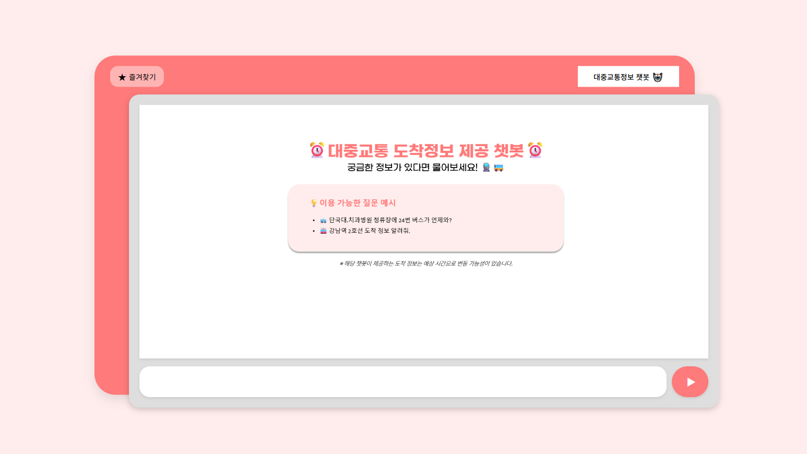
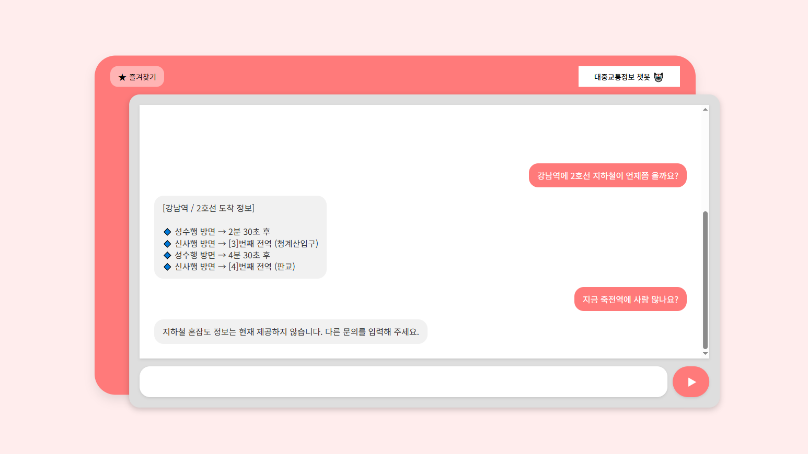
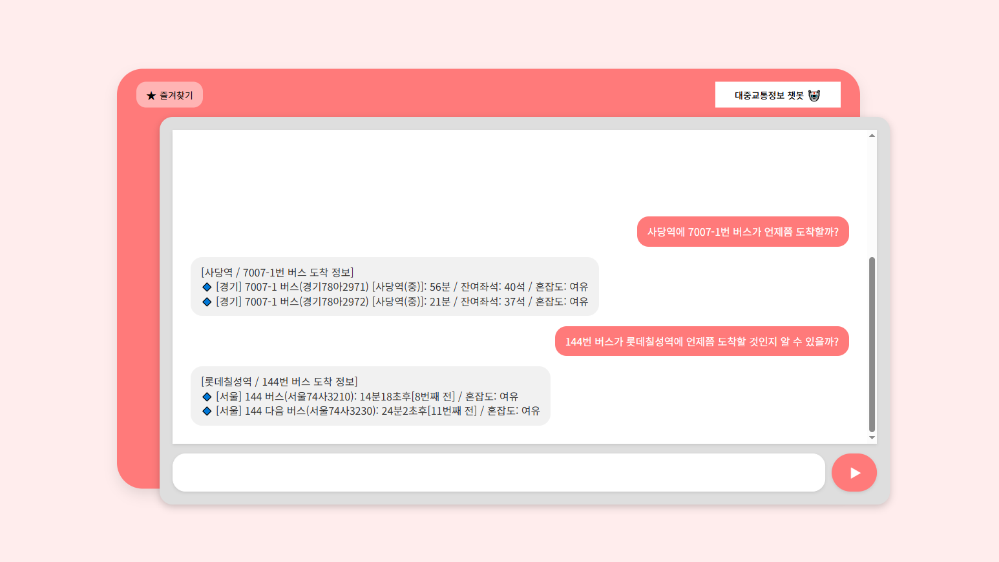
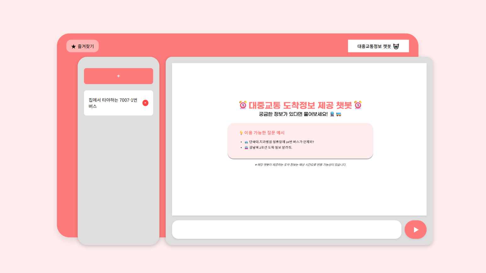
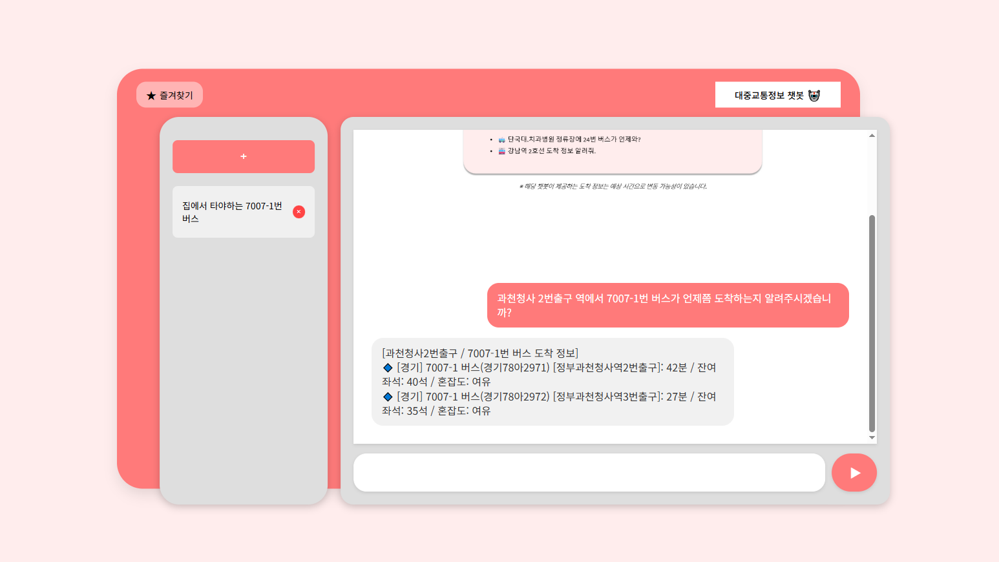
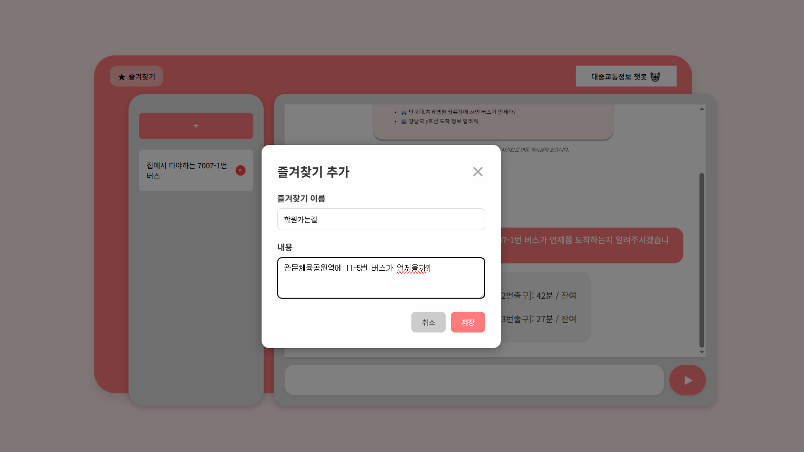
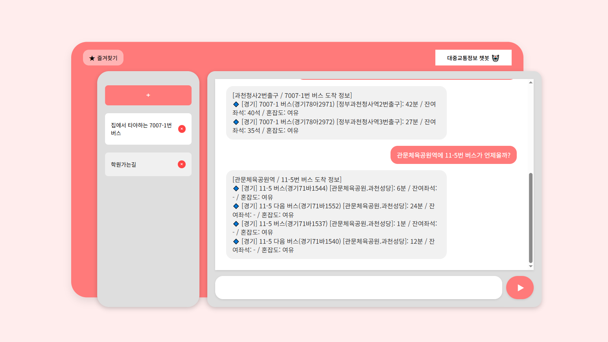
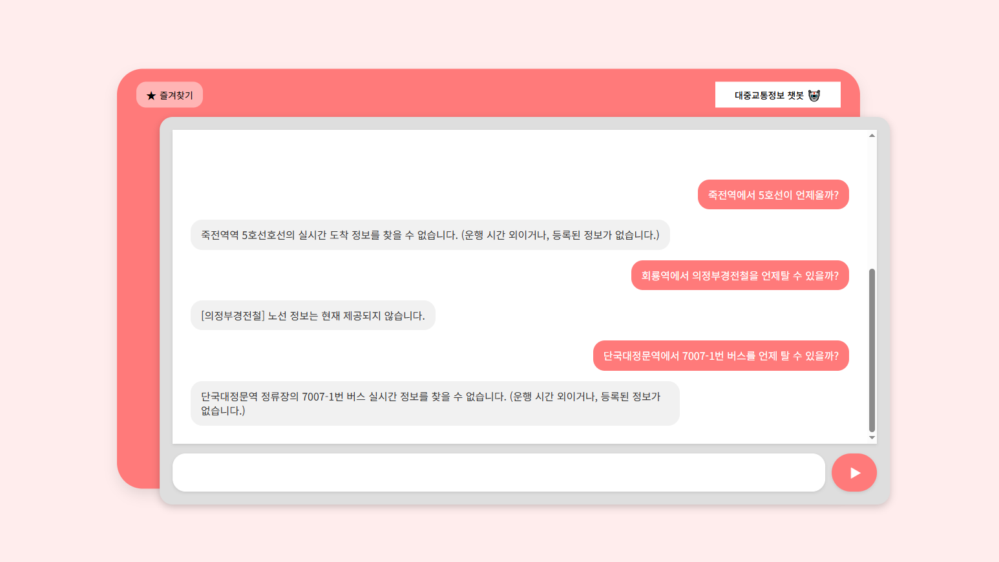

# 🚀 User Guide

## 준비물
- **Python 3.8 이상 필요**
  - **pip (최신 권장, Python 설치 시 기본 포함, 3.8 버전인 경우 유의)**
- git (방법 1 사용시 필요함)

## 🛠️ 다운로드 방법

**방법 1**
1. **깃허브에서 프로젝트를 복제(clone)합니다.**
``` terminal
git clone https://github.com/DKU-OpenSource-SW-Basic/transit-chatbot.git
```
2. **생성된 프로젝트 폴더로 이동합니다.**
``` terminal
cd transit-chatbot
```
3. **(최초 1회) 모든 환경 준비 및 실행을 자동으로 처리합니다.**
``` terminal
python setup_project.py
```
4. **이후 다시 실행하고 싶을 때에는 아래 코드를 입력하세요.**
``` terminal
python manage.py runserver
```

**방법 2**

1. `Download ZIP`을 활용하여 직접 전체 코드를 다운로드합니다.
2. 원하는 경로에 압축을 풀고, `setup_project.py`을 실행합니다.
3. 만약, 제대로 웹페이지가 나오지 않는다면, `setup_project.py`를 강제종료 혹은 직접 종료하고 다시 실행하고 기다립니다.
4. **<주의>** 열려있는 py창을 닫을경우, **강제로 웹페이지와의 연결이 끊깁니다.** 

### 만약 404 error가 뜰 경우
**가상환경**(**venv**)를 사용하시면 됩니다.  
**<주의>: venv를 사용할 경우, 여분의 저장공간(약 700MB~1GB)이 요구됩니다.**  

0. **CDM 창**을 실행한 뒤, **패키지가 있는 경로**로 이동하기.
  - cmd창은 window+R 명령어로 검색창을 연 뒤에 cmd를 입력하여 갈 수 있습니다. 
  만약 프로젝트 다운로드 경로가 `C:\Users\user\transit-chatbot`이라면 아래처럼 입력.
  ```terminal
  cd C:\Users\user\transit-chatbot
  ```
1. **가상환경 만들기**  
  ```terminal
  python -m venv venv
  ```
2. **가상환경 활성화**
    - windows:
    ```bash
    .\venv\Scripts\activate
    ```
    - macOS/Linux:
    ```bash
    source venv/bin/activate
    ```
3. **가상환경에서 다시 `setup_project.py` 실행**
   ```terminal
   python setup_project.py
   ```

### 다운로드시 추가안내
- 위 방법을 모두 시도하고도 문제가 발생한다면 에러 메시지를 복사해서 [이슈]로 남겨주세요.
- **pip** 버젼이 낮으면 제대로 실행이 안될 수 있습니다.
  ```bash
  python --version
  pip --version
  ```
  위 코드를 입력하여 버전을 확인하시고, Python은 3.8 이상, pip은 21.x 이상을 권장합니다.
  만약 pip 버전이 낮아 오류가 발생한다면 아래 명령어로 업그레이드해 주세요.
  ```bash
  python -m pip install --upgrade pip
  ```


## 📖 사용 방법
- 웹페이지의 기본 화면이다
- 아래 있는 공간에 채팅을 입력하여 대답을 받는다.  


### 🧩 버스,지하철 도착 시간 구하기

- 지하철의 도착정보 및 혼잡도를 물어본 예시이다. 현재 API문제로 혼잡도 질문은 지원하지 않는다.   
 <br>
- 각각 경기 버스와 서울 버스의 도착정보를 물어본 예시이다.  


### 🧩 즐겨찾기 사용방법
- 즐겨찾기 기본 화면이다. 우측 상단의 `★ 즐겨찾기` 버튼을 눌러 활성화할 수 있다. 
- **`+`** 를 눌러서 새로운 즐겨찾기를 등록할 수도 있고, 기존에 등록해두었던 즐겨찾기를 통해 바로 질문을 할 수도 있다. 
 <br>
- 기존에 등록해둔 즐겨찾기를 누르면 저장해 둔 문장으로 바로 질문을 한다.
- `과천청사 2번출구 역에서 7007-1번 버스가 언제쯤 도착하는지 알려주시겠습니까?`라는 문장이 즉시 입력되며, 바로 결과를 보여주는 것을 알 수 있다. 
 <br>
- 즐겨찾기 이름을 지정할 수 있고, 평소에 자주 할만한 문장을 저장해둘 수 있다. 
 <br>
- 방금 입력했던 문장이 **즐겨찾기 이름**으로 저장되는 것을 확인할 수 있다. 
- 저장된 즐겨찾기 버튼을 누르면, 방금 저장했던 그 문장으로 바로 질문하는 모습을 볼 수 있다.


### 🧩 지원하지 않는 질문, 부족한 정보에 대한 질문 처리
- 역/정거장의 정보를 누락했거나, 버스/지하철의 대한 정보를 입력하지 않았을 경우 사용자에게 정보를 제공하지 않는다. 
 <br>
- 역/정거장의 정보를 잘못 입력했거나, 아직 배차가 되지 않거나 하는 등의 이유로 정보를 제대로 받지 못했을 경우 아래와 같은 문구가 나온다.
- `의정부경전철`, `용인경전철`, `인천1,2호선` 등 일부 노선의 경우는 해당 API에서 지원하지 않아 정보를 제공하지 않는다. 

