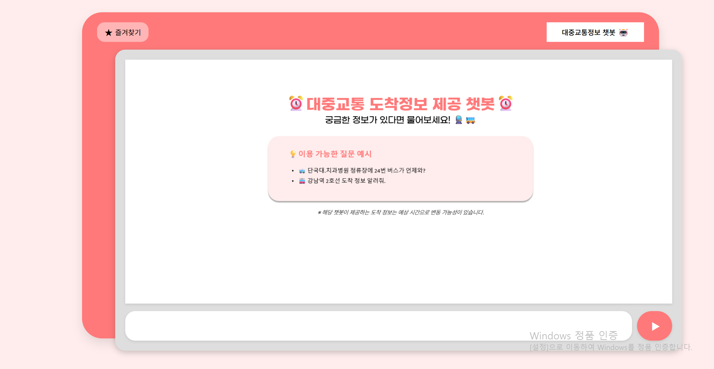
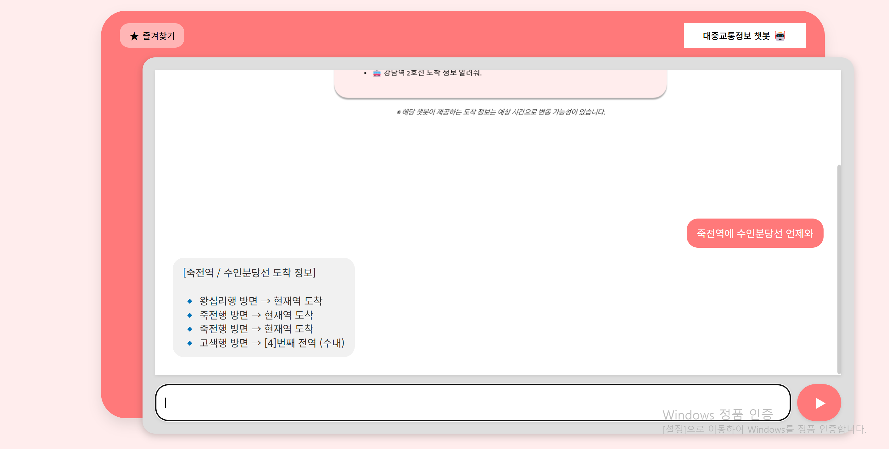
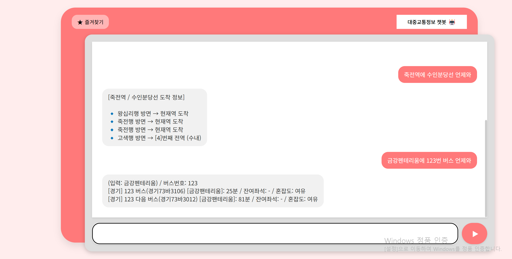
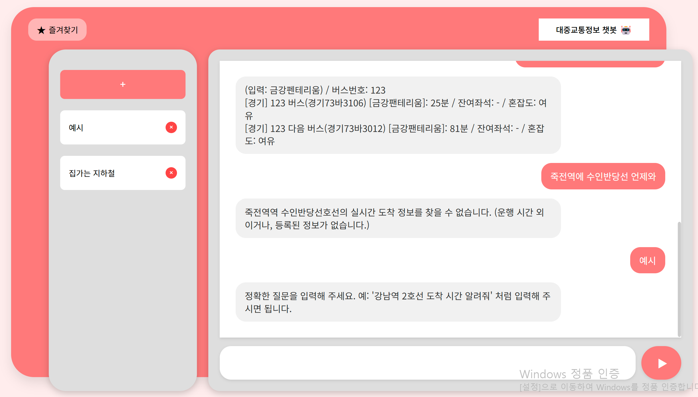
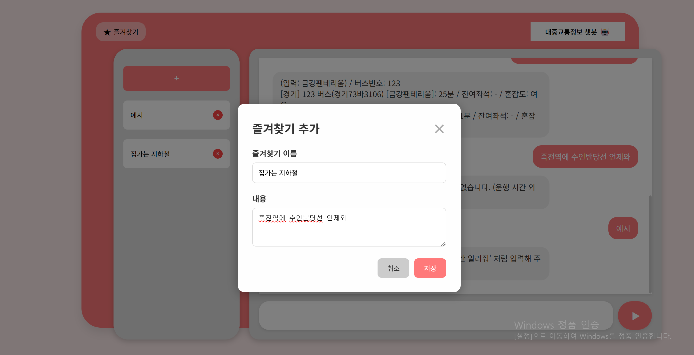
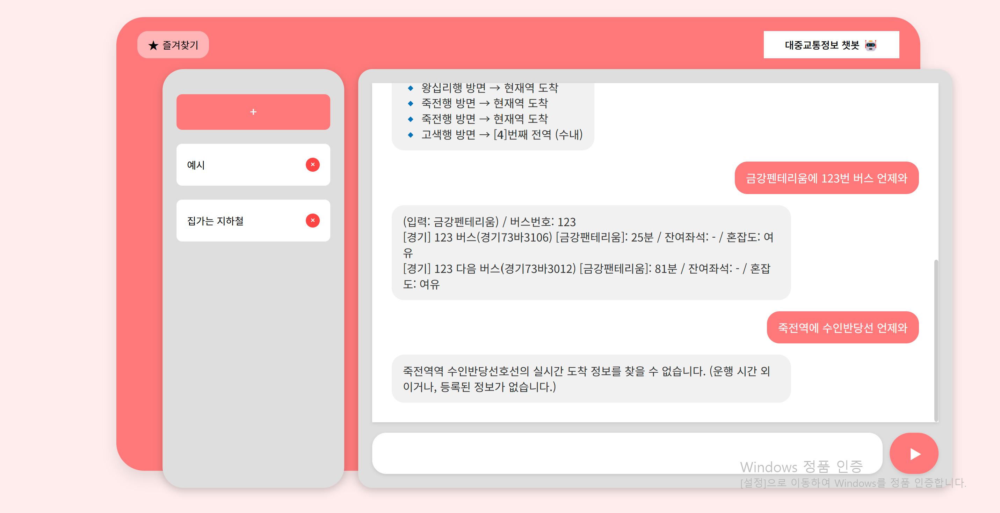

# 🚀 User Guide

## 🛠️ 다운로드 방법


``` bash
# 1. 깃허브에서 프로젝트를 복제(clone)합니다.
git clone https://github.com/DKU-OpenSource-SW-Basic/transit-chatbot.git

# 2. 생성된 프로젝트 폴더로 이동합니다.
cd transit-chatbot

# 3. (최초 1회) 모든 환경 준비 및 실행을 자동으로 처리합니다.
python setup_project.py
```
``` terminal
python manage.py runserver
```
``` bash
만약 python manage.py runserver 명령어로 실행했는데 404가 뜬다면,
where manage.py
코드를 실행하여 경로를 확인하고, transit-chatbot 폴더가 아닌 경로로 지정되어 있거나 비어있다면
python manage.py runserver --settings=chatbot_project.settings
명령어를 입력하시면 해결될 수 있습니다.
```

## 📖 사용 방법법
- 웹페이지의 기본 화면이다
- 아래 있는 공간에 채팅을 입력하여 대답을 받는다.



### 🧩 버스,지하철 도착 시간 구하기

- 지하철의 도착정보를 물어본 예시이다.


- 버스의 도착정보를 물어본 예시이다.



### 🧩 즐겨찾기 사용방법
- 즐겨 찾기 기본 화면이다.
-  플러스스 를 눌러서 새로운 즐겨찾기를 등록하거나
- 이전에 만든 것을 눌러서 채팅하지않고 도착정보를 바로 받을수 있다.


- 이름을 지정하고 원하는 질문을 작성하여 저장장해둘수 있다.


- 블럭을 누르면 저장해둔 질문에 대한 도착정보를 알려준다.

