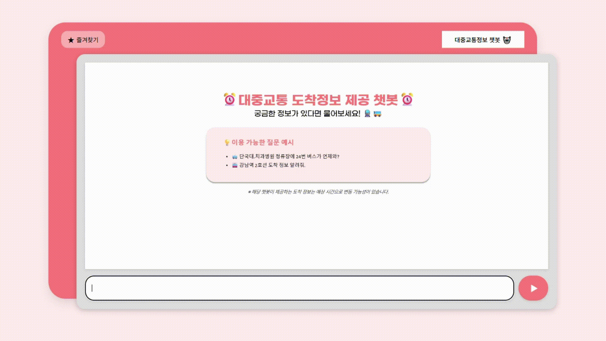

# 🚀 Guide
## 프로젝트 개요
자신이 기다리는 대중교통이 언제 오는지 알고 싶은 사람을 위한 프로젝트이다. 

## 사용 목적
- 서울,경기 지역의 지하철과 버스 도착정보를 제공하는것이다.
- 웹 사이트에서 텍스트 기반 챗봇과 상호작용하여 도착정보를 받아온다.

## 📖 사용 시나리오

#### 버스 도착시간 요청
- 사이트의 채팅 화면에서 챗봇 실행.
- 질문에 정류장 이름과 버스 번호를 포함하여 질문한다.
- 잠시후 챗봇이 질문한 정류장에 도착하는 가장빠른 버스의 도착정보를 알려준다.
#### 지하철 도착시간 요청
- 사이트의 채팅 화면에서 챗봇 실행.
- 질문에 역 이름과 지하철 호선 정보를 포함하여 질문한다.
- 잠시후 챗봇이 질문한 역에 가장빠른 질문한 지하철의 도착정보를 알려준다.

📖 [유저 가이드 보기](UserGuide.md)

📖 [개발자 가이드 보기](DeveloperGuide.md)
